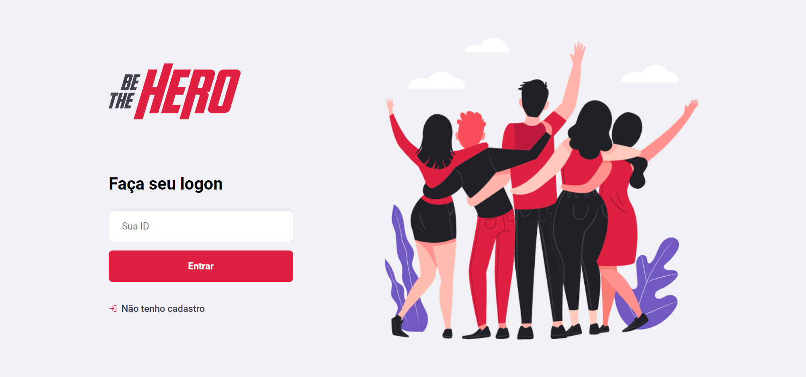
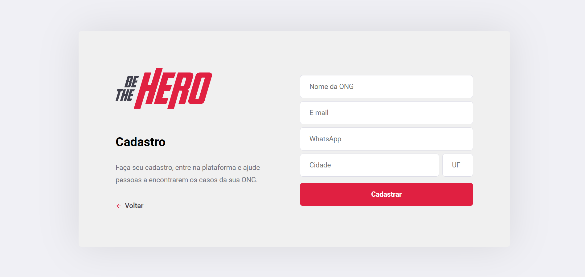
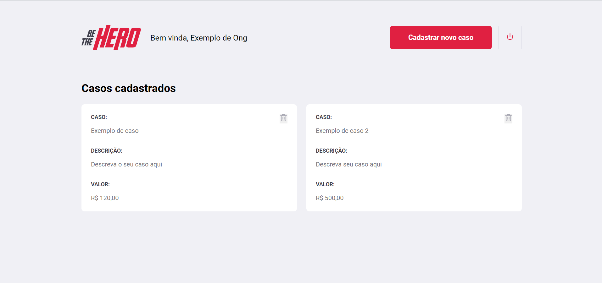
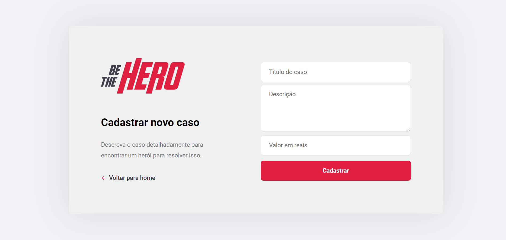
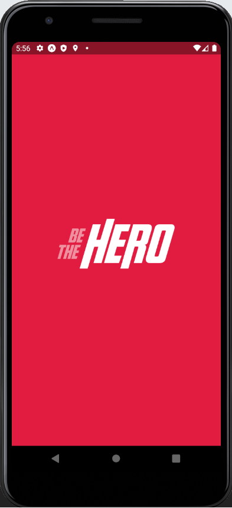
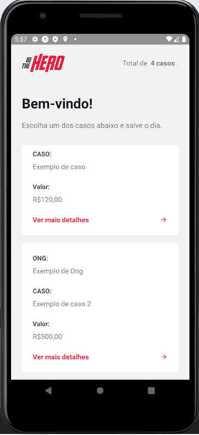
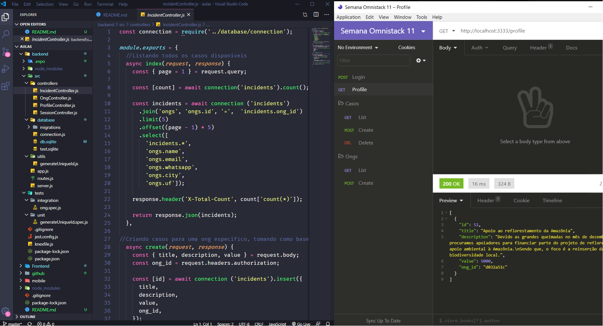

<h1 align="center">
  
</h1>

<h2 align="center">
 Semana Omnistack 11.0 
   
</h2>

   <a href="#projeto--">Projeto</a>&nbsp;&nbsp;&nbsp;|&nbsp;&nbsp;&nbsp;
  <a href="#tecnologias-usadas-rocket">Tecnologias</a>&nbsp;&nbsp;&nbsp;|&nbsp;&nbsp;&nbsp;
  <a href="#layouts">Layout</a>&nbsp;&nbsp;&nbsp;|&nbsp;&nbsp;&nbsp;
  <a href="##rodando-a-aplicação">Utilizando a aplicação</a>&nbsp;&nbsp;&nbsp;|&nbsp;&nbsp;&nbsp;
  <a href="#como-contribuir">Como contribuir</a>&nbsp;&nbsp;&nbsp;|&nbsp;&nbsp;&nbsp;
  <a href="#memo-licença">Licença</a>

 

 # Projeto   
 

O <strong>Be The Hero</strong> é um projeto desenvolvido com Node.js, React.js e React Native, cuja a ideia é conectar possíveis financiadores (Heróis) a campanhas criadas por ONG's.

A aplicação foi desenvolvida durante a Semana Omnistack 11.0 promovida pela Rocketseat. O projeto avançou por todas as camadas de desenvolvimento, tratando as melhores tecnologias do mercado, levando o aluno a desenvolver dês do back-end até o front-end mobile.

 # Tecnologias usadas :rocket:
Principais tecnologias utilizadas para o desenvolvimento back-end, front-end, mobile, banco de dados, conexões, rotas, validações e testes automatizados.
- [Node.js](https://nodejs.org/en/)
- [React](https://reactjs.org)
- [React Native](https://facebook.github.io/react-native/)
- [Expo](https://expo.io/)
- [Express](https://expressjs.com/pt-br/)
- [Axios](https://www.npmjs.com/package/axios)
- [KnexJS](http://knexjs.org/)
- [Nodemon](https://nodemon.io/)
- [SQLite3](https://www.sqlite.org/index.html)
- [Jest](https://jestjs.io/)
- [Supertest](https://www.npmjs.com/package/supertest)
- [Celebrate](https://github.com/arb/celebrate)
- [Cors](https://developer.mozilla.org/pt-BR/docs/Web/HTTP/Controle_Acesso_CORS)
- [Cross-env](https://www.npmjs.com/package/cross-env)
- [Insomnia](https://insomnia.rest/)
 
# Layouts
<h2>
  Front-end desenvolvido com React.js 
  
</h2>

<h2>
  Front-end mobile desenvolvido com React Native  
  
  emulando em Android
  

</h2>

<h2> 
  Back-end desenvolvido com Node.js
  
 </h2> 
 

# Rodando a aplicação 

#### Back-end
1 - `npm install` para baixar todas as dependências necessárias.

2 - `npx knex migrate:latest` para executar as migrations e criar as tabelas do banco de dados.

3 - `npm start` para rodar o servidor.

#### Front-end Web
1 - `npm install` para baixar todas as dependências necessárias.

2 - `npm start` para rodar o servidor.

# Como contribuir 

- Faça um fork desse repositório;
- Cria uma branch com a sua feature: `git checkout -b minha-feature`;
- Faça commit das suas alterações: `git commit -m 'feat: Minha nova feature'`;
- Faça push para a sua branch: `git push origin minha-feature`.

Depois que o merge da sua pull request for feito, você pode deletar a sua branch.

# :memo: Licença 

Esse projeto está sob a licença MIT. Veja o arquivo [LICENSE](github.com/soaresmiltinho/LICENSE.md) para mais informções.

---

Feito com ❤️ by **Milton Soares**
